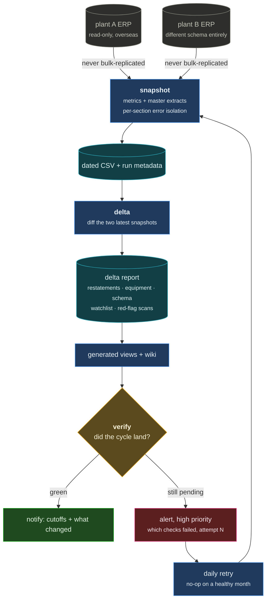
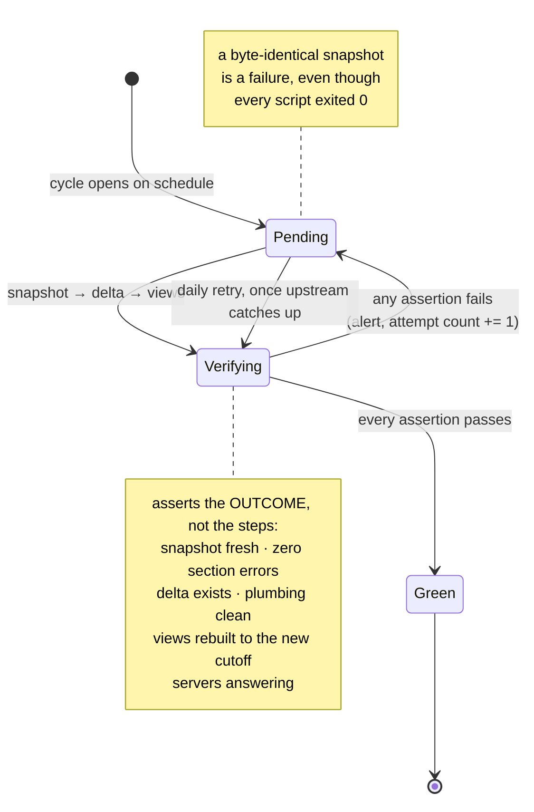
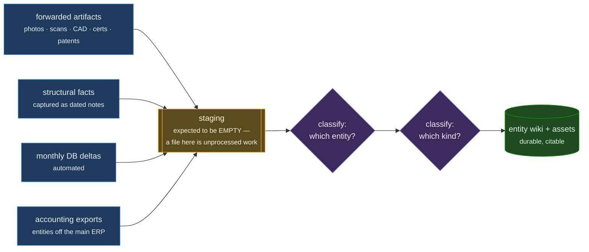

# ERP Digital Twin

A queryable model of how a manufacturing business actually runs, synthesized from two
legacy ERP databases that shipped with no schema documentation, no ERD, and no data
dictionary.

_Public overview of a private client project. The subject company, its plants, its ERP
vendor and its customers are replaced throughout by stable pseudonyms — `ClientCo`,
`PlantA`, `PlantB`, `ERP-A` — in the prose and in the [code](code/) alike. All figures are
omitted. The two extraction scripts are withheld entirely; see [code/README.md](code/README.md)
for why._

## The situation

Two plants in different countries, each on its own ageing SQL Server ERP instance, both
reachable read-only over a slow intercontinental link. No documentation of any kind, a
one-person IT function on the other side, and hundreds of tables with opaque
abbreviations as names — half of them empty, several of them lying about what they hold.

The goal is not a report. It is a **living twin**: one knowledge base that connects the
physical chain to the financial one — every raw material in, every machine it touches,
every finished good out, every amount booked — so a question about the business can be
answered from evidence instead of from someone's recollection.

## Constraints that drove the design

- **Read-only, permanently.** No write statement of any kind is ever issued. This is
  someone's production system.
- **Query in place, never replicate.** The estate is far too large to copy, and the link
  is precious. Everything is metrics and master-data extracts, never bulk transaction
  replication.
- **Small queries first.** Row counts are unknown until measured, so every exploration
  starts bounded and widens only once the shape is known.
- **No infrastructure.** No ORM, no migrations, no containers. Plain scripts that query
  SQL and write Markdown, because the artifact that has to survive a decade is the
  written synthesis, not the tooling.

## The monthly cycle

**snapshot** captures per-entity metrics and master dumps to dated CSV plus a metadata
file. **delta** diffs the two most recent snapshots into a human-readable report — period
restatements, equipment and capability changes, watchlist hits, red-flag scans, schema
changes. **verify** then asks the only question that matters: *did the cycle land?*

Four design decisions in there are worth stating, because each one is a bug that was
prevented rather than a feature that was added:

**The ledger is captured raw, never pre-classified.** Snapshots store account × posting
period aggregates exactly as the source has them. Bucketing into revenue, cost of goods
and the rest happens downstream. If classification happened at capture time, one bad
account-prefix guess would silently corrupt every future delta, and the error would be
invisible precisely because it was consistent.

**Schema drift degrades, it doesn't crash.** Master extracts detect their columns
dynamically, so a renamed or absent column drops that column instead of killing the dump.

**One failing query is not a failed run.** Every section is wrapped so an error is
recorded in the run's metadata and the rest proceeds. A partial snapshot with a written
explanation of what's missing is worth far more than no snapshot.

**Trailing-twelve-month windows anchor on the data's own maximum date**, never on wall
clock. The upstream refresh is not always on time, and a window that quietly slides
forward while the data does not is how you compare eleven months against twelve.

The two systems are genuinely different underneath — one keeps its ledger denormalized in
a single table, the other needs a join across document header and detail to recover a
posting date; one has separate customer and vendor masters, the other a single unified
partner table playing both roles. Those differences are handled explicitly per entity
rather than papered over with an abstraction that would be wrong for both.

## The failure that shaped the whole thing

One month, every script in the chain exited zero and the cycle reported success. The
upstream standby copy had not actually been refreshed, so the run produced a snapshot
byte-identical to the previous month's. Nothing was broken in any way a process could
detect from its own exit code, and **nobody noticed for five days.**

Silent, data-shaped, exit-0 failure is the worst class of bug in any pipeline: the system
keeps telling you it is fine, and the longer it does the more downstream work is built on
a lie.

The month is now a state machine, and "the scripts ran" is not one of its accepting states:

What came out of it:

- **A deterministic verification step** that asserts what the run was supposed to
  *achieve*, not that its steps ran: is each entity's snapshot actually fresh, does it
  carry zero section errors, does the matching delta report exist, is its plumbing check
  clean, were the generated views rebuilt against the new cutoff, are the servers
  answering.
- **A cycle state machine.** The month is `pending` until verification passes. A daily
  retry job is a no-op on a healthy month and re-attempts on a broken one, so when the
  upstream refresh lands late the cycle completes itself.
- **Failure is loud.** Success notifies one channel with the new cutoffs and what changed;
  failure goes to an alerts channel at high priority, with which checks failed and how
  many attempts have been made, and keeps going until it passes.
- **Restatement detection with two thresholds.** A prior-period cell is only flagged when
  it moves by more than both a percentage *and* an absolute floor — otherwise rounding
  noise on small accounts buries the restatements that matter.

## Epistemics, which is most of the work

The hard part of a digital twin is not extraction. It is refusing to over-claim.

- **Scope is stated, not assumed.** Only two entities' books are reachable; several
  others in the group are not. So "this counterparty does not appear in the customer
  master" does **not** mean the business has no relationship with them — it means the
  relevant book is somewhere this project cannot see. Every group-level statement is
  qualified with the scope it was computed from, and questions that implicitly require
  the missing books get pushed back on rather than answered.
- **Cite it or don't write it.** Every name, code and number in the wiki must trace to a
  query run, an existing cited line, or a raw artifact. Plausible-looking identifiers
  invented by pattern-matching are the most common failure mode of an LLM working over an
  undocumented schema, and they are nearly undetectable once written down.
- **Surface the assumption in the same sentence as the number.** When a value depends on
  which field, currency, scope or denominator was chosen, that choice is stated inline.
  Silent choices propagate as silent errors.
- **Stop when confused and name what's unclear.** When sources disagree or a value doesn't
  tie out, that gets surfaced rather than silently resolved.
- **Source-language identifiers are preserved verbatim**, with English glosses added
  alongside — never replacing the original. A translated key is a broken join.

## Intake

Four channels converge on one staging directory: forwarded artifacts (photos, scans,
spreadsheets, CAD, certifications, patents), structural facts captured as dated notes,
the automated monthly database deltas, and accounting exports from the entities that
aren't on the main ERP. Everything is classified by entity first, then by kind, and the
staging directory is expected to be empty — a file sitting in it is unprocessed work.

Anything worth a future session knowing has to land somewhere durable — a wiki page, an
archived note, a snapshot — rather than in a conversation that evaporates.

## Stack

Python standard library over a SQL Server driver — no dataframes, no ORM. Output is a
Markdown wiki served locally, with generated views rebuilt each cycle and a status page
that renders the last verification result. Scheduling is cron: the monthly cycle, a daily
retry that no-ops when healthy, and a keepalive for the wiki server.

_Last updated August 2026._
